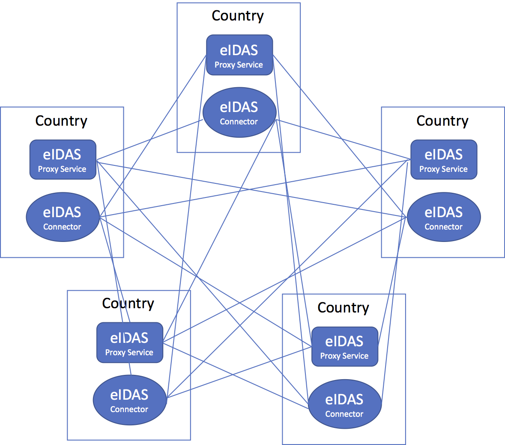

# Trust configuration for eIDAS nodes
***Study report***

*Version 0.1  - 2018-03-28*

## Background
The eIDAS technical subgroup meeting on March 21, 2018 decided to let Sweden take the lead to invite members to collaborate on cross border eIDAS node trust configuration.

The purpose of this effort is to present proposals to the technical subgroup for consideration.

This document represents the outcome of this effort.

Collaborating countries:

- Sweden

> Editor’s Note: This list will be expanded as more countries joins and supports this effort.

## Problem statement
A full-scale operation of the eIDAS authentication infrastructure includes eIDAS nodes from 28 EU member states in addition to countries that are included by agreement.

Each member state will typically have one Proxy Service and at least one Connector. Some countries may provide many Connector services.

Each unique relationship between a Proxy Service and connectors from other countries must be maintained on both ends with fresh and up to date configuration parameters and keys. As eIDAS is using metadata, the trusted configuration data is typically restricted to a metadata URL along with the key for validating the metadata signature. However, the eIDAS Interoperability architecture allows metadata to be signed either by a national key directly, or by the node entity directly through a subordinate certificate. In the latter case, each nation must ensure that all metadata entities are legitimate eIDAS nodes and the roles they are authorized to provide (Section 6.2 of eIDAS Interoperability architecture).

This means that for each node, the following trusted data may have to be configured:

- The trust anchor used to verify metadata for this node.
- Trust path to metadata signers (if necessary).
- Metadata URL.
- The country this eIDAS node is representing.
- The role (Proxy Service or Connector) this eIDAS node is authorized to provide.

Each proxy service will have to maintain this data for at least one connector in approximately 30 countries. In practice we may see a growth of connector nodes in each country, so the number may increase to over a hundred nodes.

Each connector will have to maintain this information for about 30 Proxy Service nodes in other countries.

For 60 connectors and 30 proxy services, this adds up to 3 600 individual configurations of trusted keys and parameters. This means that if each key is updated once every year, the infrastructure as a whole must do 3 600 configuration updates every year.

The current infrastructure totally relies on manual exchange of trust data, which is known to be hard and time consuming as it requires:

- A trusted and up to date register over persons from each member state that is authorized to provide trusted keys for each particular service.
- Established procedures to validate keys and parameters being exchanged (Finger prints, key phrases, codes etc.). Both the data and the authorized person must be authenticated.

If each configuration update results in 1 day down time, we will accumulate 3 600 broken days per year. This means that each and every day of the year, 10 cross border connections will not work.

 
## Federation trust configuration models

There are currently 2 main models to consider for eIDAS trust configuration:

- Peer to peer out of band trust configuration (Current model)
- Central trusted repository

The peer to peer out of band model is illustrated by the following image:

 

This setup is time consuming, hard to maintain and does not scale as the number of eIDAS nodes grows and the importance of uninterrupted service increases.

The central repository model is illustrated by the following image:

 

Here each country only shared trusted data to a single central trusted repository, which then shares this information to each eIDAS node.

The operational advantages of this model are huge:

- Each member state shares information with just one recipient.
- Each service only needs to configure one key out of band (the key necessary to trust the central repository).
- Propagation of key updates or updates to key parameters are very fast (down to minutes on frequent data caching).

The only downside of the central repository model is that the central repository service must be established and maintained by a mutually trusted entity.

 
## Proposals

The core proposal is to establish a central trusted repository for eIDAS nodes. The challenges associated with any other alternative are simply too great to handle over time.

The best alternative in the long run would be if a central trusted repository was provided by the EU commission. Understanding and recognizing that a decision to provide such a service by the EU commission may be hard and may take a long time to implement, we should also look into possible interim solutions.

The alternative interim solution is if a country, a group of countries in collaboration or individual countries offers to operate a central repository for a collection of countries. The resulting central repository or repositories may then evolve over time and may eventually be operated by the EU commission once the services has been proven to be valuable.

### Data formats

An essential aspect of a solution with central repository is to agree on the data format for:

1.	Pushing trusted data to the repository for a country.
2.	Retrieving trusted data from the central repository.

#### Pushing data format

The selected data format for providing trust data for a country should be in the form of a Metadata Service List (MSL) according to the data format specified in the eIDAS technical specifications. The MSL should meet the following requirements:

- The MSL is signed.
- The MSL lists all Metadata URL sources in the country.
- The MSL contains the certificate necessary to verify the signature on each metadata source.
- The MSL lists each trusted entity and its ID and role for each metadata source URL.

The advantage with this model of data delivery is that each country only has to provide one trusted key (the MSL verification key). All other trusted data can be obtained via the signed MSL.

#### Data format for retrieving trusted data.

Different types of eIDAS node implementations may need different type of trust data. Implementations based on typical SAML engines may prefer pure SAML metadata while CEF reference implementations traditionally will prefer metadata from separate sources using the well-known location.

It is therefore proposed to provide two types of trust data from the central repository:

1.	Standard SAML metadata. This is the aggregated metadata for all services listed in all MSL documents from all countries. Each metadata entity will contain information about what country they represent and what role they are authorized to perform.
2.	A compiled MSL holding the sum of all collected MSL.

The aggregated metadata and the compiled MSL are signed by the central repository operator.

The aggregated metadata model prevents an entity with a particular entityID from serving more than one country. If a service provider serves more than one country, it must provide a unique ID and unique metadata for each service for each country. Any EntityID appearing more than once will be removed from the aggregated metadata.

The compiled MSL holds data that can be used to configure metadata source and metadata trust direct into a node that is configured to retrieve metadata for each service on their own (such as the typical operation of the CEF reference implementation).

### Operational management

The operational management of the central repository will require a central operator that enters into agreement with all countries that are willing to participate. Some means of authentication will have to be established with at least one authorized person from each participating country.

The work to establish a central EU repository according to these principles should be initiated as soon as possible. It is however reasonable to assume that this will take some time. To support this process with actual experience, volunteering countries could choose to setup limited collaborations that may spread and expand over time.

